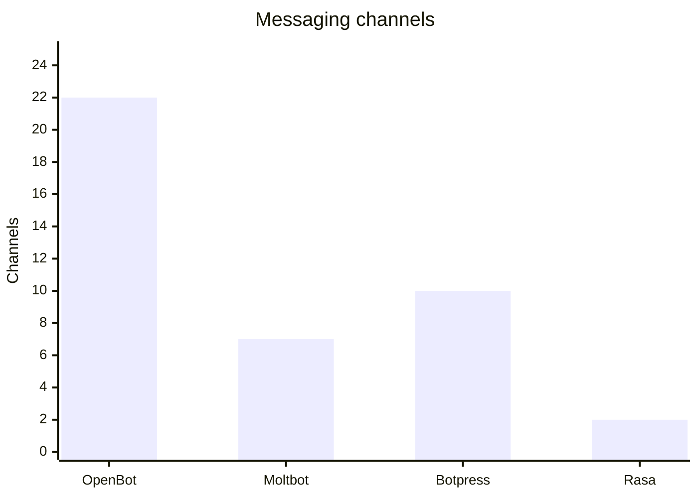
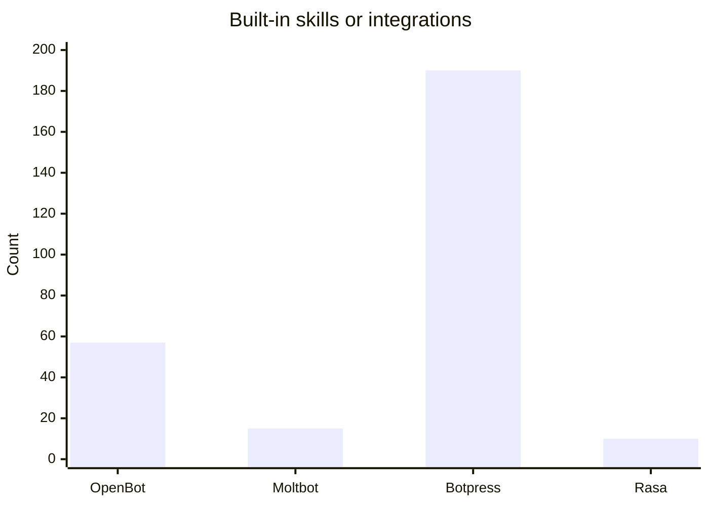
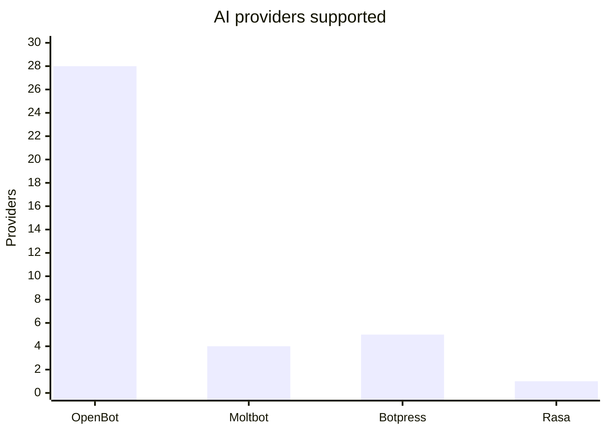
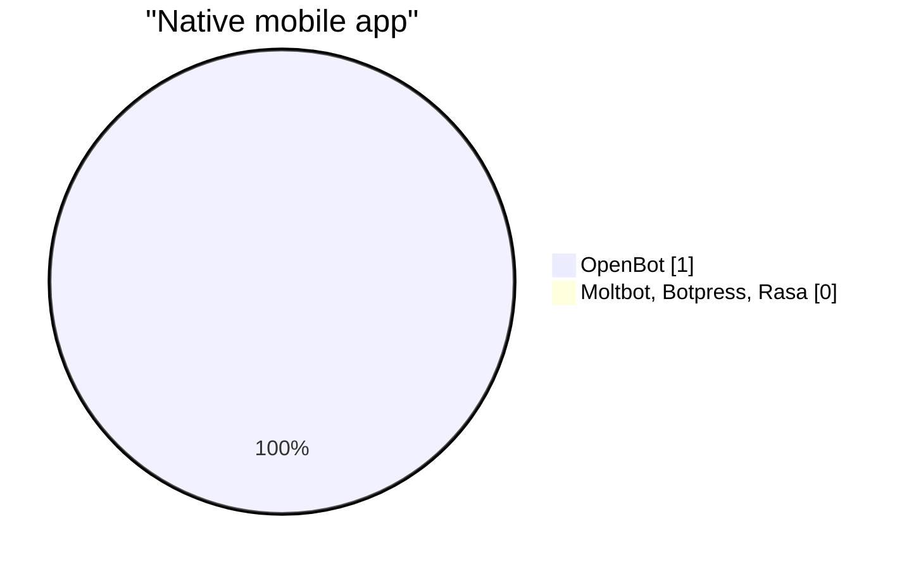
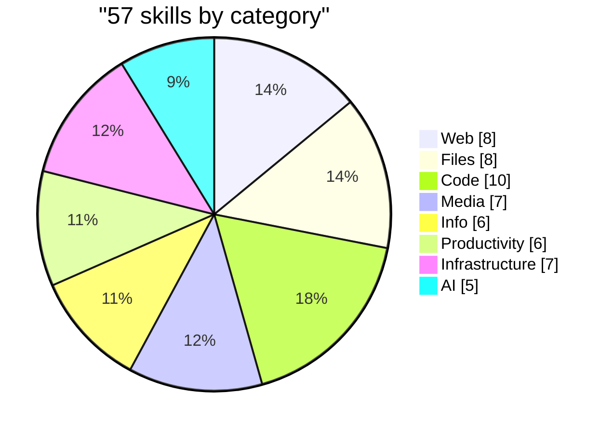

<div align="center">


# **OpenBot**

### *Enterprise-Grade AI. Your Infrastructure. Your Control.*

**The self-hosted AI agent platform for teams who demand privacy, flexibility, and scale.**

[](https://nodejs.org)
[](LICENSE)
[](skills/)
[](gateway/channels/)
[](gateway/ai-router.js)
[](install.sh)

---

[Quick Start](#-quick-start) •
[Compare](#-compare) •
[Features](#-features) •
[Architecture](#-architecture) •
[Deployment](#-deployment) •
[Documentation](#-configuration--documentation) •
[Security](SECURITY.md) •
[Contributing](CONTRIBUTING.md)

</div>

---

## Overview

**OpenBot** is a fully self-hosted AI agent platform that runs on your own infrastructure. One deployment powers a unified AI experience across **web**, **mobile**, and **22 messaging channels**—Telegram, Discord, Slack, WhatsApp, and more—with a single gateway and the AI model of your choice.

- **Data sovereignty** — Conversations and models stay on your servers. No third-party data pipelines.
- **Multi-provider** — 28 AI providers (Anthropic, OpenAI, OpenRouter, Ollama, Groq, DeepSeek, and others). Swap models without changing code.
- **Extensible** — 57 built-in skills (web search, code, files, calendar, email, browser automation, and more). Add custom skills and agents in plain text.

Built for developers and teams who need a production-ready, vendor-neutral AI layer.

---

## Compare

How OpenBot stacks up against other self-hosted AI assistant platforms:

| | **OpenBot** | **Moltbot** | **Botpress** | **Rasa** |
|---|:---:|:---:|:---:|:---:|
| **Self-hosted** | ✅ | ✅ | ✅ | ✅ |
| **Messaging channels** | **22** (Telegram, Discord, Slack, WhatsApp, Signal, iMessage, Teams, Matrix, LINE, …) | 7+ (WhatsApp, Telegram, Discord, Slack, Signal, iMessage, WebChat) | 10+ (Web, WhatsApp, Slack, Teams, Twilio, …) | Web, APIs; add-ons for Slack/WhatsApp |
| **AI providers** | **28** (Anthropic, OpenAI, OpenRouter, Ollama, Groq, DeepSeek, …) | Multiple (Anthropic, OpenAI, Google, local) | Multiple LLMs | Custom NLU / ML pipelines |
| **Built-in skills / tools** | **57** (web, code, files, calendar, email, browser, …) | Skills plugin system, configurable | 190+ integrations, visual flows | Custom; code-first |
| **Web dashboard** | ✅ | ✅ | ✅ (visual builder) | ✅ (Rasa X) |
| **Mobile app** | ✅ (Expo) | — | — | — |
| **CLI** | ✅ (`openbot` — doctor, agents, memory, daemon, cron) | ✅ | — | ✅ |
| **Config** | File-based (`.env`, `openbot.json`, `AGENTS.md`) | File-based (`moltbot.json`) | UI + config | Code / YAML |
| **License** | MIT | MIT | AGPL / commercial | Apache 2.0 |

OpenBot focuses on **one codebase, one gateway**: maximum channels and AI providers, file-based config, and a single CLI for local and production control—no vendor lock-in.

### Charts

**Messaging channels (more = better)**



**Built-in skills / tools**



**AI providers (direct model backends)**



**Share of platforms with native mobile app**



**Skills by category (OpenBot)**



> OpenBot leads on **channels** and **AI providers**; Botpress leads on total **integrations** (190+). Rasa is code-first—provider/skill counts are not directly comparable.

---

## Quick Start

**Requirements:** Node.js 20+

```bash
# Clone and install
git clone https://github.com/openbot/openbot.git && cd openbot
npm install

# Configure (add your API key)
cp .env.example .env
# Edit .env: ANTHROPIC_API_KEY=sk-ant-... (or OPENAI_API_KEY, OLLAMA_URL, etc.)

# Start the gateway
npm start
```

Open **http://localhost:18789** for the web dashboard. You’re ready.

To run the test suite: start the gateway (`npm start`), then in another terminal run `npm test` (or `node test-suite.mjs`).

<details>
<summary><b>Get an API key</b></summary>

| Provider | Get key | Notes |
|----------|---------|--------|
| **Anthropic Claude** | [console.anthropic.com](https://console.anthropic.com) | Recommended |
| **OpenAI** | [platform.openai.com](https://platform.openai.com) | GPT-4o and more |
| **DeepSeek** | [platform.deepseek.com](https://platform.deepseek.com) | Cost-effective |
| **OpenRouter** | [openrouter.ai/keys](https://openrouter.ai/keys) | 200+ models |
| **Ollama** | [ollama.ai](https://ollama.ai) | Local, no key |
| **Groq** | [console.groq.com](https://console.groq.com) | Free tier |

Set in `.env`: `ANTHROPIC_API_KEY=sk-ant-...` (or the provider you use).

</details>

---

## Features

### 57 built-in skills

| Category | Examples |
|----------|----------|
| **Web** | `web-search`, `browser`, `http`, `rss`, `firecrawl` |
| **Files** | `file`, `pdf`, `zip`, `markdown`, `json`, `base64` |
| **Code** | `shell`, `git`, `github`, `docker`, `database`, `code_review` |
| **Media** | `image`, `voice`, `screenshot`, `ocr`, `qr-code` |
| **Info** | `weather`, `news`, `stocks`, `crypto`, `translate` |
| **Productivity** | `calendar`, `email`, `reminders`, `notes`, `memory` |
| **Infrastructure** | `system`, `ping`, `dns`, `port-scan`, `ssl-check` |
| **AI** | `llm-task`, `summarize`, `canvas` |

### 22 messaging channels

Telegram · Discord · Slack · WhatsApp · Signal · iMessage · Matrix · Microsoft Teams · Google Chat · LINE · Mattermost · IRC · WeChat · Feishu · Zalo · Nostr · Synology Chat · Twitch · Nextcloud Talk · Outlook · Gmail PubSub · **Web UI**

### Multiple agents (from `AGENTS.md`)

| Agent | Role |
|-------|------|
| `@default` | General assistant |
| `@coder` | Software development & debugging |
| `@researcher` | Deep research & synthesis |
| `@creative` | Writing, design, brainstorming |
| `@devops` | Infrastructure & operations |

Define your own agents with model and skill sets in a single markdown file.

---

## Architecture

```
┌─────────────────────────────────────────────────────────────────┐
│                        OpenBot Gateway                           │
│  (Express + WebSocket · AI router · Skills · Memory · Sessions)  │
└─────────────────────────────────────────────────────────────────┘
     │                    │                    │
     ▼                    ▼                    ▼
┌──────────┐      ┌──────────────┐      ┌─────────────┐
│ Web UI   │      │ 22 Channels   │      │ Mobile App  │
│ :18789   │      │ (Telegram,…)  │      │ (Expo)      │
└──────────┘      └──────────────┘      └─────────────┘
     │                    │                    │
     └────────────────────┼────────────────────┘
                          ▼
              ┌───────────────────────┐
              │  28 AI Providers      │
              │  (Anthropic, OpenAI,  │
              │   OpenRouter, Ollama…)│
              └───────────────────────┘
```

| Component | Description |
|-----------|-------------|
| **gateway/** | Core server, AI router, skill engine, memory, session manager, channel adapters |
| **skills/** | 57 built-in skills (tools the agent can call) |
| **cli/** | `openbot` CLI: onboard, doctor, agents, memory, daemon, cron, gateway |
| **ui/** | Web dashboard (single-page app served at `/`) |
| **mobile/** | React Native (Expo) app connecting to your gateway |

---

## Configuration & documentation

| File | Purpose |
|------|---------|
| **`.env`** | API keys and secrets (do not commit) |
| **`openbot.json`** | Gateway config: model, port, tool security |
| **`SOUL.md`** | Agent personality and system prompt |
| **`AGENTS.md`** | Multiple agents: model and skills per agent |

**CLI overview:**

```bash
openbot onboard          # Interactive setup
openbot doctor           # Diagnose configuration
openbot agent list       # List agents
openbot memory search "…"  # Search agent memory
openbot daemon start     # Run as background service
openbot cron list       # Scheduled tasks
openbot --help          # All commands
```

---

## Deployment

**PM2 (recommended for servers):**

```bash
npm install -g pm2
pm2 start gateway/server.js --name openbot
pm2 save && pm2 startup
```

**System service (launchd / systemd / Task Scheduler):**

```bash
openbot daemon install
openbot daemon start
```

**Docker:**

```bash
docker-compose up -d
```

**Security (production):** Do not expose the gateway to the public internet without a reverse proxy (TLS + auth) or firewall. The dashboard and API can read/write config and secrets. See [SECURITY.md](SECURITY.md).

**Production checklist:** Use a process manager (PM2, systemd, or Docker). The gateway supports graceful shutdown (SIGTERM/SIGINT), exposes `GET /health` for load balancers, and logs uncaught errors before exit. Optional: set `NODE_ENV=production` and tune `gateway.bodyLimit` in config if needed.

**Cloudflare Workers:**

```bash
cp wrangler.toml.example wrangler.toml
# Set account ID and secrets, then:
wrangler deploy
```

---

## Messaging channels (setup)

Add the corresponding variables to `.env`; the gateway enables each channel automatically.

| Channel | `.env` variable |
|---------|------------------|
| Telegram | `TELEGRAM_BOT_TOKEN` (from [@BotFather](https://t.me/BotFather)) |
| Discord | `DISCORD_BOT_TOKEN` ([discord.com/developers](https://discord.com/developers)) |
| Slack | `SLACK_BOT_TOKEN`, `SLACK_SIGNING_SECRET`, `SLACK_APP_TOKEN` |
| WhatsApp | No token — scan QR in dashboard on first run |

---

## Mobile app

The React Native (Expo) app talks to your self-hosted gateway.

```bash
cd mobile && npm install && npx expo start
```

Set the gateway URL in the app (e.g. `http://your-server:18789`).

---

## Troubleshooting

| Issue | Action |
|-------|--------|
| "API key not configured" | Ensure `.env` has a key (`ANTHROPIC_API_KEY`, `OPENAI_API_KEY`, etc.) and restart. |
| Port 18789 in use | Set `GATEWAY_PORT=3001` or `"port": 3001` in `openbot.json`. |
| Skills not loading | Run `openbot doctor` and `openbot skills list`. |
| WebSocket drops | Check firewall/reverse proxy; ensure WebSocket upgrade is allowed. |

---

## License

**MIT** — use, modify, and distribute with minimal restrictions.

---

<div align="center">

**OpenBot** — *Your infrastructure. Your AI. Your rules.*

Built with Node.js · Express · Anthropic SDK · OpenAI SDK · Discord.js · node-telegram-bot-api · whatsapp-web.js · Expo

</div>
